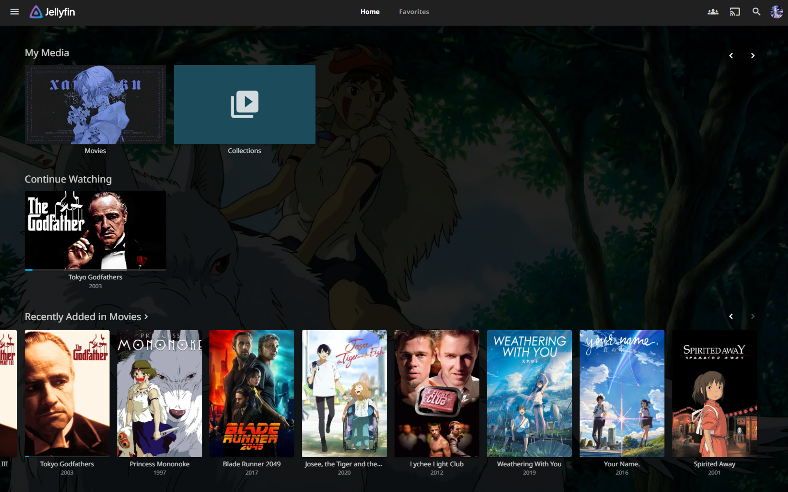

## _<div align="left"><sub>// Media Server Compose for Coolify</sub></div>_

<div align="left"><sub>// Self-Hosted Media Management & Streaming Stack for Coolify</sub></div>

<br>

All services are combined into a single Coolify environment, featuring a Docker Compose setup that streamlines the deployment of a complete media management and streaming stack. This stack integrates popular services like Radarr, Sonarr, Transmission, Prowlarr, and Jellyfin—orchestrated seamlessly to deliver a hassle-free, self-hosted media automation solution. For certain indexers, you may optionally require FlareSolverr to bypass restrictions and enhance functionality.

<div align="center">
  <a href="#-services-overview"><kbd> <br> Services Overview <br> </kbd></a>&ensp;&ensp;
  <a href="#-quick-start-guide"><kbd> <br> Quick Start Guide <br> </kbd></a>&ensp;&ensp;
  <a href="https://github.com/parazeeknova/mediaserver-compose/blob/main/LICENSE"><kbd> <br> License <br> </kbd></a>&ensp;&ensp;
</div>

---

###### _<div align="left"><sub>// Preview</sub></div>_

<div align="center">
  
  <a href="https://github.com/parazeeknova/mediaserver-compose">
    
  </a>
  
</div>

#### _<div align="left"><sub>// Services Overview</sub></div>_

Here are the core services included in this stack:

##### _<div align="left"><sub>// Prowlarr</sub></div>_
   - **Description:** Indexer manager for Torrent and Usenet services.
   - **Port:** `9696`
   - **Purpose:** Serves as a centralized indexer manager for Radarr and Sonarr, streamlining the media search process.
   - **Health Check:** Monitors the `/ping` endpoint.

##### _<div align="left"><sub>// Radarr</sub></div>_
   - **Description:** Movie download manager.
   - **Port:** `7878`
   - **Purpose:** Automates movie downloading, renaming, and organizing through torrents.
   - **Health Check:** Monitors the `/ping` endpoint.

##### _<div align="left"><sub>// Sonarr</sub></div>_
   - **Description:** TV series download manager.
   - **Port:** `8989`
   - **Purpose:** Automates TV series downloading, renaming, and organizing through torrents.
   - **Health Check:** Monitors the `/ping` endpoint.

##### _<div align="left"><sub>// Transmission</sub></div>_
   - **Description:** Torrent client.
   - **Port:** `9091`
   - **Purpose:** Manages torrent downloads for Radarr and Sonarr with ease.
   - **Health Check:** Monitors the Transmission web interface for operational health.

##### _<div align="left"><sub>// Jellyfin</sub></div>_
   - **Description:** Media server for streaming.
   - **Port:** `8096`
   - **Purpose:** Provides a Netflix-like experience for streaming your downloaded movies and TV shows.
   - **Health Check:** Monitors the root endpoint.

#### _<div align="left"><sub>// Quick Start Guide</sub></div>_

##### Prerequisites
1. Ensure that required ports (9696, 7878, 8989, 9091, 8096) are open and available.
2. Configure the following variables:

```env
SERVICE_FQDN_PROWLARR=<your-domain-or-ip>
SERVICE_FQDN_RADARR=<your-domain-or-ip>
SERVICE_FQDN_SONARR=<your-domain-or-ip>
SERVICE_FQDN_TRANSMISSION=<your-domain-or-ip>
SERVICE_FQDN_JELLYFIN=<your-domain-or-ip>
TZ=Asia/Kolkata
SERVICE_USER_ADMIN=admin
SERVICE_PASSWORD_ADMIN=password
